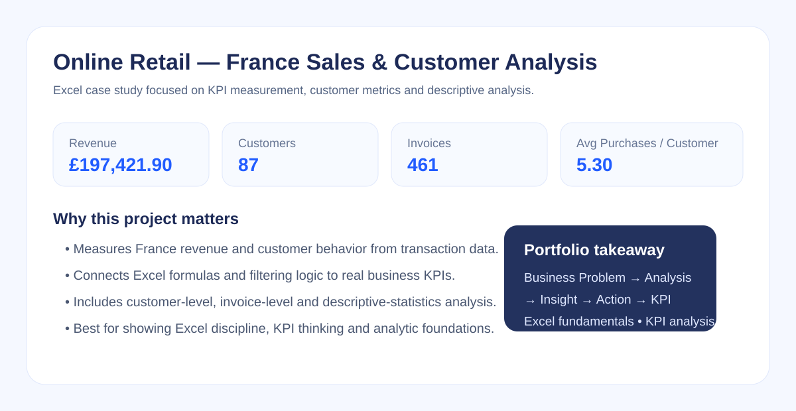

# Online Retail — France Sales & Customer Analysis | Case Study

## Project Overview

This Excel case study analyzes Online Retail transaction data with a specific focus on **France sales performance and customer behavior**.

The project demonstrates how transaction-level data can be transformed into a structured business analysis using Excel formulas, customer and invoice metrics, descriptive statistics and business interpretation.

**Project Type:** Case Study  
**Focus:** Sales Analytics / Customer Analytics / Excel

---

## Business Questions

The analysis was designed to answer:

- How much sales revenue is generated in France?
- How many unique customers and invoices are there?
- How much revenue does an average customer generate?
- How frequently does an average customer purchase?
- How much time passes between purchases?
- Which transaction generates the highest single-line revenue?
- How variable are Price, Quantity and Revenue?
- Are there observations that may require outlier investigation?

---

## Key Results — France

| KPI | Result |
|---|---:|
| Total Sales Revenue | **£197,421.90** |
| Unique Customers | **87** |
| Unique Invoices | **461** |
| Average Revenue / Customer | **£2,269.22** |
| Average Purchases / Customer | **5.30** |
| Average Time Between Purchases | **70.39 days** |
| Highest Single-Line Revenue | **£4,161.06** |
| Total Quantity | **110,481** |

### Business Interpretation

The France customer base generated approximately **£197K in revenue across 461 invoices**. With 87 unique customers, the analysis provides a compact view of customer value, purchase frequency and repurchase timing that can support market-level CRM or sales follow-up.

The purpose of these KPIs is not only to report totals, but to create a baseline for questions such as:

- Which customers contribute the most revenue?
- Which customers purchase frequently but generate lower value?
- Which customers may be due for re-engagement based on time since purchase?

---

## Analytical Workflow

**Raw Transactions → Data Filtering → Revenue Calculation → Customer Analysis → Invoice Analysis → Purchase Behaviour → Descriptive Statistics → Business Insights**

---

## Analysis Areas

### Sales & Revenue

- Total revenue
- Total quantity
- Revenue calculation using `Quantity × Price`
- Highest-revenue transaction
- Daily revenue checks

### Customer Analytics

- Unique customer count
- Average revenue per customer
- Average quantity per customer
- Average number of purchases per customer
- Average time between purchases

### Invoice Analytics

- Unique invoice analysis
- Invoice-level sales calculations
- France invoice filtering and review

### Descriptive Statistics

The workbook also includes:

- Coefficient of Variation (CV)
- Quartiles
- Interquartile Range (IQR)
- Potential outlier identification
- Relative variability interpretation for Price, Quantity and Revenue

---

## Excel Skills Demonstrated

The workbook includes practical use of functions such as:

- `COUNT`
- `COUNTA`
- `COUNTIFS`
- `SUMIF`
- `SUMIFS`
- `TRIM`
- `CONCATENATE`
- `LEFT`
- `RIGHT`
- `WEEKDAY`
- `EXACT`

These functions support filtering, counting, text cleaning, date handling and conditional calculations inside the analysis workflow.

---

## Workbook Structure

### `00 | DASHBOARD`
Main KPI overview and project summary.

### `Year 2010-2011`
Source transaction data used in the analysis.

### `functions`
Excel function exercises and supporting calculations.

### `France Sales Analysis`
Customer, invoice, revenue, purchase behaviour and statistical analysis.

### `04 | INSIGHTS`
Business-oriented interpretation of the analytical outputs.

### `05 | GUIDE`
Workbook navigation and usage notes.

---

## Project File

- `Miuul_Online_Retail_Analysis.xlsx` — complete Excel analysis workbook

The workbook retains formulas and calculations so the analysis process can be reviewed, not only the final outputs.

---

## Skills Demonstrated

- Microsoft Excel
- KPI Calculation
- Sales Analysis
- Customer Analytics
- Invoice Analysis
- Purchase Frequency Analysis
- Descriptive Statistics
- Outlier Analysis
- Business Insight Generation

---

## Portfolio Role

This case study demonstrates the Excel and KPI-analysis foundations used in the broader [E-Commerce Customer Analytics Capstone Project](../03-ecommerce-customer-analytics/).

It was originally developed during the **Miuul Excel & CRM Analytics** training program and refined here as a portfolio case study focused on business interpretation.