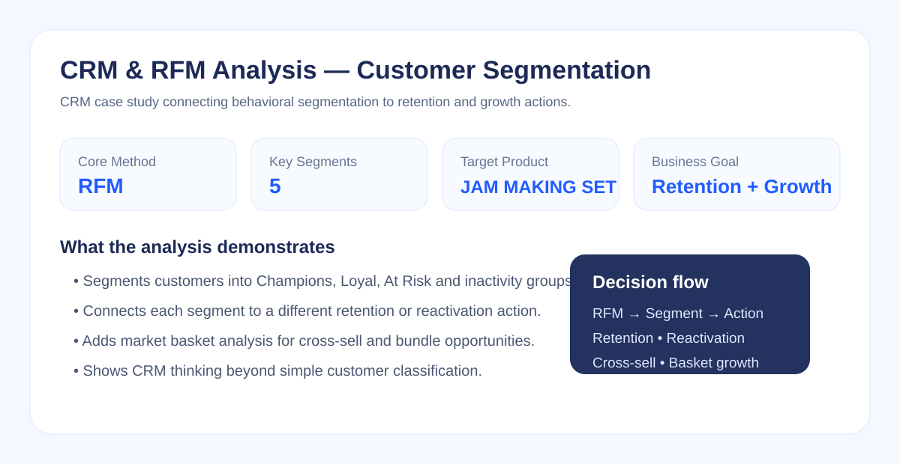

# CRM & RFM Analysis — Customer Segmentation Case Study

## Project Overview

This case study focuses on customer segmentation and CRM decision-making using **RFM Analysis (Recency, Frequency, Monetary)** and supporting market basket analysis.

The objective is to move beyond customer-level calculations and translate behavioral patterns into practical retention, reactivation and cross-sell strategies.

---

## Business Problem

A retail business does not want to communicate with every customer in the same way.

The analysis therefore aims to answer:

- Which customers are the most valuable?
- Which customers are still active and loyal?
- Which customers show signs of becoming inactive?
- Which customers should be targeted with reactivation campaigns?
- Which products can be promoted together to increase basket value?

---

## Analytical Framework

**Transaction Data → Customer Aggregation → RFM Metrics → RFM Scoring → Customer Segments → CRM Actions**

### RFM Metrics

- **Recency:** How recently the customer purchased
- **Frequency:** How often the customer purchased
- **Monetary:** How much revenue the customer generated

RFM values were transformed into score-based customer segments so that different customer groups could be managed with different CRM actions.

---

## Customer Segmentation

The analysis uses customer behavior to identify segments such as:

- **Champions** — recent, frequent and high-value customers
- **Loyal Customers** — customers with strong repeat-purchase behavior
- **At Risk** — previously valuable customers whose recent activity has weakened
- **About to Sleep** — customers showing early inactivity signals
- **Hibernating** — customers with low recent engagement

The purpose of the segmentation is not only classification; each segment is connected to a different business action.

---

## Segment-Based Business Actions

| Segment | Business Objective | Example Action |
|---|---|---|
| Champions | Retain high-value customers | VIP benefits, loyalty rewards, early-access offers |
| Loyal Customers | Increase customer value | Cross-sell, upsell, personalized product recommendations |
| At Risk | Prevent churn | Reactivation campaign, personalized incentive, urgency-based offer |
| About to Sleep | Re-engage early | Reminder campaign, category-based recommendation |
| Hibernating | Recover selectively | Low-cost win-back campaign and response-based targeting |

The main principle is to avoid applying the same campaign to every customer segment.

---

## Market Basket Analysis

The case study also includes product-association analysis to identify products that may be sold together.

The target product used in the analysis is:

**JAM MAKING SET WITH JARS**

Association metrics are used to evaluate product relationships:

- **Support** — how frequently an item combination appears
- **Confidence** — how often the related product appears when the target product is purchased
- **Lift** — whether the relationship is stronger than would be expected by chance

The business objective is to identify bundle and cross-sell opportunities that can increase average basket value.

---

## Business Interpretation

The project demonstrates how customer analytics can support three different CRM decisions:

1. **Retention:** Protect valuable and loyal customer segments.
2. **Reactivation:** Detect inactivity risk and target customers before they are fully lost.
3. **Growth:** Use product-association insights to increase basket value through relevant recommendations.

---

## Deliverables

This folder contains the working analysis and presentation outputs used in the case study, including:

- Excel-based CRM / RFM analysis
- Market basket analysis output
- RFM and product strategy presentation files

### Project Files

- `A - CRM_MB_Data_Retail_Ham_analizi.xlsx`
- `Data_.xlsx`
- `CRM_Market_Basket_Sunum.pdf`
- `CRM_RFM_Analysis_JAM_MAKING_SET_WITH_JARS.pdf`

> File names above reflect the original working files. The analytical logic and business interpretation are summarized in this README for easier portfolio review.

---

## Skills Demonstrated

- Microsoft Excel
- CRM Analytics
- RFM Analysis
- Customer Segmentation
- Customer Retention
- Churn / Inactivity Risk Thinking
- Reactivation Strategy
- Market Basket Analysis
- Support, Confidence and Lift
- Cross-Sell Strategy
- Business Insight Generation

---

## Portfolio Role

**Project Type:** Case Study  
**Focus:** CRM Analytics / Customer Segmentation / Retention

This project supports the broader [E-Commerce Customer Analytics Capstone Project](../03-ecommerce-customer-analytics/) by demonstrating the customer segmentation and product-association techniques used in more focused form.
