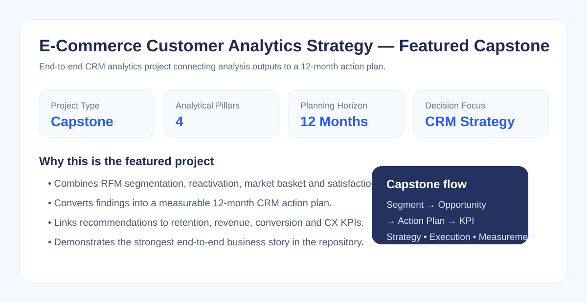

# E-Commerce Customer Analytics Strategy — Featured Capstone Project

## Project Overview

This is the **featured capstone project** of the repository.

The project analyzes e-commerce customer and sales data to develop a data-driven customer growth strategy for the next 12 months. It combines multiple CRM and customer analytics methods within a single business decision framework.

The analysis was conducted using Microsoft Excel and focuses on three connected areas:

- RFM customer segmentation
- Market basket analysis
- Customer satisfaction analysis

The main objective is not only to describe customer behavior, but to convert analytical findings into measurable CRM actions.

---

## Business Problem

The project is designed around four management questions:

- Which customers should be protected, grown or reactivated?
- Which product combinations create cross-sell opportunities?
- Which customer-experience problems should be prioritized first?
- Which actions should be monitored during the next 12 months?

The analytical flow is:

**Customer Data → Segmentation → Opportunity Detection → Business Insight → Action Plan → KPI Tracking**

---

## 1. RFM Customer Segmentation

Customers were evaluated using:

- **Recency:** Days since the last purchase
- **Frequency:** Number of purchases
- **Monetary:** Total customer spending

The analysis identifies customer groups such as high-value customers, loyal customers, customers at risk of churn and inactive customers.

### Business Use

RFM segmentation supports differentiated CRM actions instead of applying the same campaign to the entire customer base.

Example actions include:

- Loyalty / VIP treatment for high-value customers
- Cross-sell and upsell for loyal customers
- Reactivation campaigns for At-Risk customers
- Low-cost win-back actions for inactive customers

---

## 2. Reactivation Strategy

A reactivation approach was designed for customers showing signs of inactivity.

The purpose is to:

- Detect valuable customers before they become fully inactive
- Prioritize retention budget toward higher-potential customers
- Measure campaign success with retention, conversion and revenue KPIs

This connects segmentation directly to CRM execution.

---

## 3. Market Basket Analysis

The product **`JAM MAKING SET WITH JARS`** was selected as the target product.

Support, confidence and lift metrics were used to evaluate products frequently purchased together with the target item.

### Business Use

The findings can support:

- Product bundles
- Cross-sell recommendations
- Basket-expansion campaigns
- Product recommendation logic

The objective is to increase average basket value through relevant product combinations rather than generic promotions.

---

## 4. Customer Satisfaction Analysis

Customer satisfaction data was evaluated using **importance** and **satisfaction** together.

A satisfaction map was used to separate:

- High-priority improvement areas
- Strengths to maintain
- Lower-impact areas
- Potential over-investment areas

### Key Finding

**Website / App Performance** emerged as a major improvement priority.

This demonstrates why a low satisfaction score alone is not enough; improvement decisions should also consider business importance.

---

## 5. 12-Month Business Action Plan

The final stage of the project converts the analysis into a practical management roadmap.

### Recommended Actions

- Launch targeted reactivation campaigns for At-Risk customers
- Develop product bundles around the selected target product
- Improve website and application performance
- Monitor customer satisfaction and NPS regularly
- Track campaign performance using retention, revenue and conversion KPIs
- Review segment movement over time to identify changing customer behavior

---

## KPI Framework

Recommended KPIs for monitoring the strategy include:

- Retention Rate
- Reactivation Rate
- Campaign Conversion Rate
- Revenue by Customer Segment
- Average Basket Value
- Repeat Purchase Rate
- NPS / Customer Satisfaction
- Segment Migration

The purpose is to connect each recommendation to a measurable outcome.

---

## Tools & Methods

- Microsoft Excel
- Pivot Tables
- RFM Analysis
- Customer Segmentation
- Market Basket Analysis
- Support, Confidence and Lift
- Customer Satisfaction Map
- CRM Strategy
- PowerPoint
- Business Insight Generation

---

## Project Files

- `CRM_HM07_260826.xlsx` — Excel analysis workbook
- `CRM_Ecommerce_1_Yillik_Strateji_Huseyin_Yanmaz.pptx` — 12-month strategy presentation

> The file names are retained from the original working project. This README provides the portfolio-level business context and analytical story.

---

## Portfolio Role

**Project Type:** Featured Capstone Project  
**Focus:** CRM Analytics / Customer Analytics / Business Strategy

This project brings together the main analytical themes demonstrated across the repository: customer segmentation, retention, product affinity, customer experience and action-oriented business recommendations.
