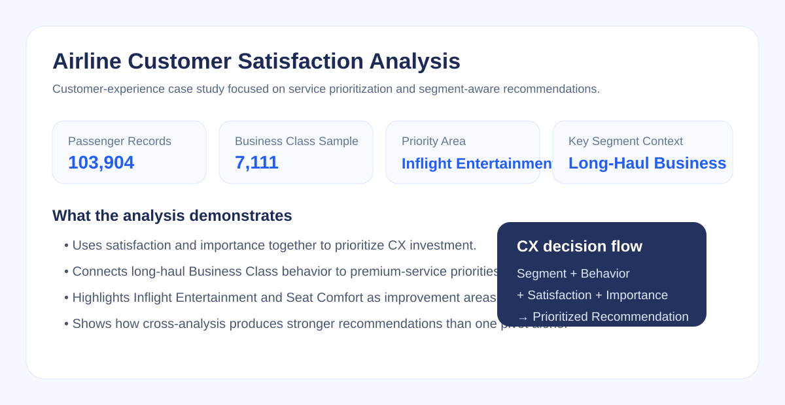

# ✈️ Airline Customer Satisfaction Analysis | Case Study

## Project Overview

This Excel case study analyzes airline customer satisfaction with a focus on **Business Class experience, service prioritization, flight-distance behavior, demographic segmentation and operational metrics**.

The project follows a business-first workflow:

**Business Question → Excel Analysis → Insight → Business Implication → Recommended Action**

**Project Type:** Case Study  
**Focus:** Customer Experience Analytics / Service Prioritization / Excel

---

## Dataset

The dataset contains **103,904 passenger records** with variables covering demographics, travel class, flight distance, service ratings, operational delays, satisfaction and NPS.

A separate **Business Class sample of 7,111 passengers** was analyzed in more detail to investigate the premium customer experience.

---

## Business Questions

The analysis focuses on:

- Which Business Class service areas perform best and worst?
- Which low-scoring services are also important to customers?
- How does flight distance differ by travel class?
- Do age and gender meaningfully differentiate customer experience?
- Do operational delays explain schedule-convenience satisfaction?
- Which findings should translate into concrete business actions?

---

## Executive Summary

The strongest cross-analysis finding is that **Business Class passengers are concentrated in long-distance travel while Seat Comfort and Inflight Entertainment are among the weakest premium-experience attributes**.

Inflight Entertainment also shows relatively high customer importance, making it a more meaningful improvement opportunity than simply targeting every low-scoring service equally.

This suggests a focused CX priority:

> **Improve the premium onboard experience for long-haul Business Class passengers.**

---

## 1. Business Class Service Performance

### Strongest Service Areas

| Service Attribute | Satisfaction |
|---|---:|
| Baggage Handling | **85.4%** |
| Inflight Service | **81.8%** |
| Online Boarding | **70.9%** |
| On-board Service | **70.2%** |
| Leg Room Service | **68.6%** |

### Main Improvement Areas

| Service Attribute | Satisfaction |
|---|---:|
| Inflight Entertainment | **48.6%** |
| Seat Comfort | **48.8%** |
| Departure / Arrival Time Convenience | **50.3%** |
| Ease of Online Booking | **50.6%** |
| Gate Location | **51.8%** |

### Business Insight

Operational services perform relatively strongly, while two attributes directly connected to the premium onboard experience — **Seat Comfort and Inflight Entertainment** — are among the weakest areas.

---

## 2. Satisfaction Map

Service attributes were evaluated through two dimensions:

- **Importance**
- **Customer Satisfaction**

A key example is **Inflight Entertainment**:

- Importance: **0.582**
- Satisfaction: **48.6%**

This combination of relatively high importance and low satisfaction makes it a stronger improvement candidate than looking at satisfaction scores alone.

**Decision principle:**

> High Importance + Low Satisfaction = Higher Improvement Priority

---

## 3. Class vs Flight Distance

| Class | Short Flight | Medium Flight | Long Flight |
|---|---:|---:|---:|
| Business | 21.8% | 21.9% | **56.3%** |
| Economy | **43.7%** | **44.2%** | 12.1% |
| Economy Plus | **45.4%** | **41.5%** | 13.1% |

### Business Insight

More than half of Business Class passengers are concentrated in **long-distance flights**, while Economy and Economy Plus are concentrated mainly in short and medium distances.

This strengthens the case for prioritizing premium-experience improvements on long-haul Business Class routes.

---

## 4. Age & Gender Segmentation

Selected service scores were compared across age and gender groups.

| Metric | Female | Male |
|---|---:|---:|
| Inflight Wi-Fi | 3.63 | 3.61 |
| Inflight Entertainment | 2.82 | 2.83 |
| Seat Comfort | 2.88 | 2.86 |
| Cleanliness | 3.48 | 3.49 |

Gender differences are minimal in these measures, while age groups show more meaningful variation.

### Business Implication

Customer-experience personalization may be more useful when based on **age + flight distance + travel class** rather than gender alone.

---

## 5. Schedule Convenience vs Delays

| Flight Type | Convenience Score | Departure Delay | Arrival Delay |
|---|---:|---:|---:|
| Short Flight | 54.8 | 14.22 min | 14.87 min |
| Medium Flight | **57.2** | **15.65 min** | **15.99 min** |
| Long Flight | **52.8** | 14.58 min | 14.67 min |

Medium-distance flights have the highest average delays but also the highest convenience score.

### Business Insight

**Operational delay alone does not explain perceived schedule convenience.** Other factors such as departure time, arrival time, connections and schedule flexibility should also be investigated.

---

## Cross-Analysis Logic

**Business Class**  
→ 56.3% long-distance travel  
→ Seat Comfort & Inflight Entertainment among weakest services  
→ Inflight Entertainment also relatively important  
→ **Priority: long-haul premium onboard experience**

This is stronger than interpreting individual Pivot Tables separately because it combines:

**Customer Segment + Flight Behavior + Satisfaction + Service Importance**

---

## Business Recommendations

1. **Improve Inflight Entertainment** — expand content variety, improve usability and mobile/device access.
2. **Investigate Seat Comfort** — analyze aircraft and seat configuration, especially on long-haul Business Class routes.
3. **Prioritize Long-Haul Premium Experience** — focus improvement investment where Business Class exposure is greatest.
4. **Use Multi-Dimensional Segmentation** — combine age, flight distance, class and travel type rather than gender alone.
5. **Investigate Schedule Convenience Beyond Delays** — include schedule timing, route structure and connection availability in future analysis.

---

## Tools & Methods

- Microsoft Excel
- Pivot Tables
- Data Filtering
- Customer Segmentation
- Satisfaction Scoring
- Satisfaction Mapping
- Descriptive Statistics
- Business KPI Analysis
- Customer Experience Analytics
- Cross-Analysis
- Business Insight Generation

---

## Project Files

- `Airline_Customer_Satisfaction_Analysis.xlsx` — Excel analysis workbook
- `Airline_Customer_Satisfaction_Executive_Deck.pdf` — executive presentation

---

## Portfolio Role

This case study demonstrates how Excel analysis can move from descriptive customer-experience metrics to **service prioritization and action-oriented recommendations**.

It complements the broader [E-Commerce Customer Analytics Capstone Project](../03-ecommerce-customer-analytics/) by showing customer-experience analysis in a different business context.